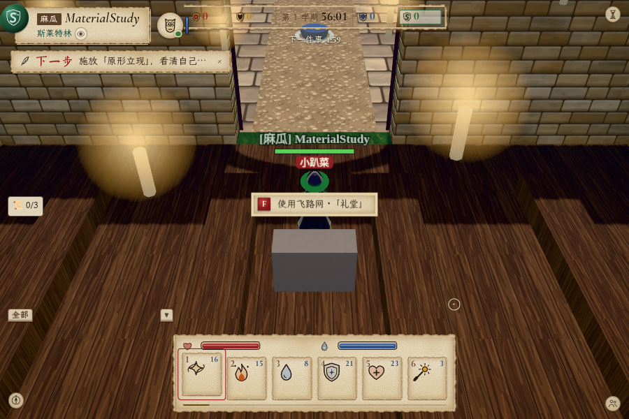
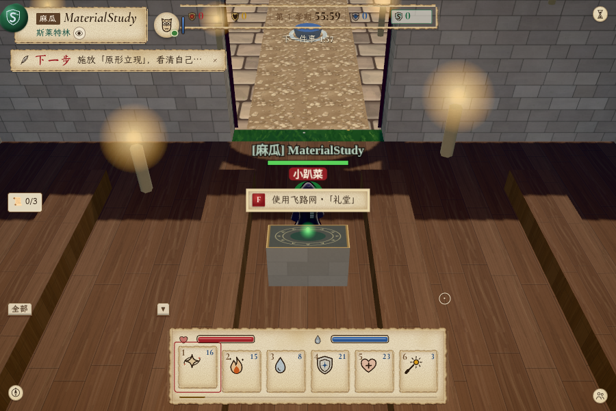
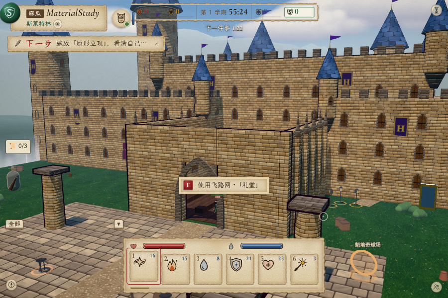
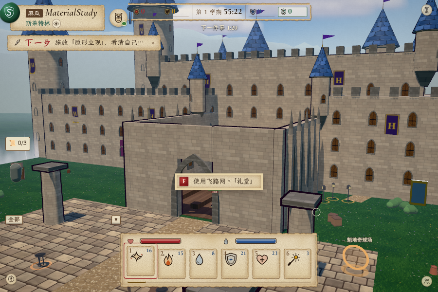
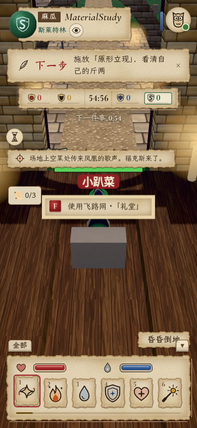
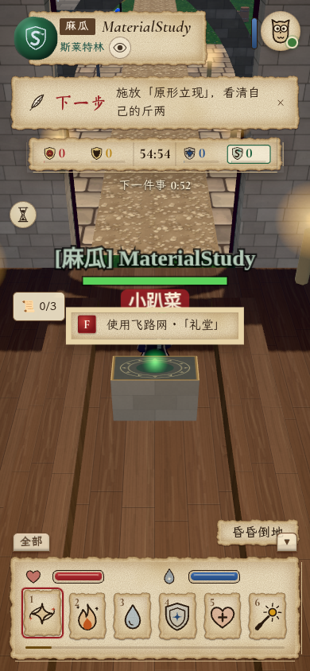

# 第 16 轮：石灰岩、胡桃木与炼金飞路台

用户先要求调研程序员相关游戏的风格，再选择了“古典魔法学院与精密炼金器具”的概念对照并要求实装。本轮把这个方向落实到默认手绘材质；下方图片全部来自生产构建的真实浏览器渲染，不是概念图。

方向参考：[Opus Magnum](https://www.zachtronics.com/opus-magnum/) 的炼金机器与器具感、[shapez 2](https://shapez2.com/) 对内部运行过程可见性的强调，以及 [TIS-100](https://www.zachtronics.com/tis-100/) 与复古计算机手册一致的题材表达。这里借鉴材质组织和状态可读性，没有证据将某种画风概括为所有程序员的偏好。

基线：`ff556bc`。材质实现：`0d185f5`，夜间烛身细调：`8a174a2`。类型检查、813 项测试（80 个文件）和生产构建通过。

## 实装内容

- `client/textures.ts`：默认石墙使用暖灰石灰岩色调，缩小圆角与灰缝，去掉宽亮边和重凸起；胡桃木保持 256² 贴图，改为四块宽板、错开的端缝、柔和色带与细弯木纹。
- `client/hearth.ts`、`client/panels/travel.ts`：为既有六个实例化飞路台绘制原创 512×256 石材/黄铜/符文图集，只给顶面使用符文区域。绿色光点移到台面上方并收敛大小；图集与实例资源由插件上下文在重载时释放。
- `client/scene.ts`：默认手绘模式的蜡烛光晕缩小。原有写实模式保留其表面、烛光大小与飞路光点位置。
- UI、碰撞、场景布局、传送目的地与内核规则均无改动。没有把参考游戏截图或生成概念图导入游戏素材；来源说明见 `client/public/textures/CREDITS.md`。

首轮实机检查发现宽木板在日光下稍显平淡，因此最终版补了细弯纤维并调整木色、石色；夜间检查又发现烛身泛光偏重，`8a174a2` 将默认模式的烛身发光颜色缩放到 0.4，保留既有火焰与礼堂光源。最终默认模式对照使用 `8a174a2`；[细调前夜间图](screenshots/candidate-night-hall.png)与[该次记录](candidate-night.json)保留作对照。写实检查在 `0d185f5` 完成，末次细调仅作用于默认手绘模式。

## 实机前后对照

| 场景 | 改动前 | 实装后 |
|---|---|---|
| 礼堂 900×600 |  |  |
| 城堡 900×600 |  |  |
| 手机窄屏 390×844 |  |  |

附加检查：[夜间礼堂](screenshots/after-night-hall.png)、[写实模式](screenshots/after-real-hall.png)。

## 条件与交互

Chromium / ANGLE / SwiftShader，生产静态文件，`?capture=1&perf=1&q=high`，固定 1× 渲染比例。手机图仅为窄屏布局与渲染检查，不代表物理手机 GPU 或触控测试。

先通过游戏 UI 入学，再复用保存在仓库外的私有浏览器状态。前后服务器使用同一份私有世界存档，分别从正午、晴天、7200 秒一天开始。测试准备只改隔离存档的时钟和天气，不改生产规则代码；世界仍正常运行，动画、光影和实体细节不会逐像素相同。每张图记录实际时间、机位、视口和渲染比例。

礼堂与手机机位：`pos=[0,11,-58]`、`look=[0,1,-46]`；外景：`pos=[26,19,5]`、`look=[0,10,-48]`。机位通过既有 capture 钩子设置。角色通过正常 MCP `move_to`/`wait` 到达礼堂；键盘 F 打开五目的地菜单，Escape 关闭。全部检查结果与采样见 [before.json](before.json)、[after.json](after.json)、[after-night.json](after-night.json)、[after-real.json](after-real.json)。

脚本：[materials.mjs](materials.mjs)。示例（先用隔离服务器与存档准备私有状态）：

```bash
LABEL=after SAMPLES=20 SCREEN_OUT=/tmp/material-shots \
  PRIVATE_STATE=/tmp/material-private.json \
  PLAYWRIGHT_CORE=/path/to/playwright-core/index.mjs \
  node docs/playtest-logs/2026-10-04/round16/materials.mjs
```

夜间准备同一隔离存档的时钟为 22 时；写实检查使用 `STYLE=real SHOTS=hall`。私有世界与浏览器状态含密钥，未归档。

夜间附加检查首轮的导航到达断言没有通过，未保存该次完整返回原因，因此不把它归因于材质或某种导航停止原因。脚本随后改为先去礼堂相邻点 `z=-50` 再返回 `z=-46`，要求 `wait` 观察实际路径后再截图；夜间最终记录使用这版脚本。基线与写实记录使用最初的单段移动；最终默认模式与夜间记录使用相邻点往返，固定截图机位相同。

## 渲染预算

前后每个固定视图采集 20 个已渲染帧。全场景的绘制次数会随实体、粒子与裁剪变化；飞路静态部分仍只有一组实例化箱体和一组 Points，没有新增灯或模型部件。石墙与木板贴图尺寸保持原值，新增一张飞路图集（RGBA8 含 mipmaps 约 0.67 MiB）。

完整数字见 [PERF](../../../PERF.md)。软件渲染的短窗口用于方向检查，不推导硬件 GPU 帧率或真机流畅度。
